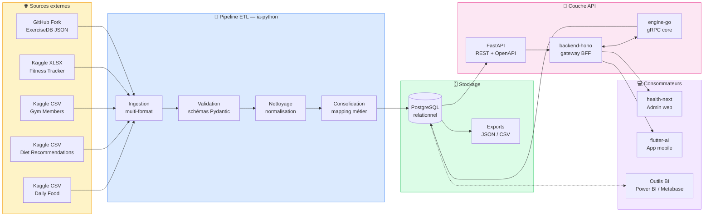
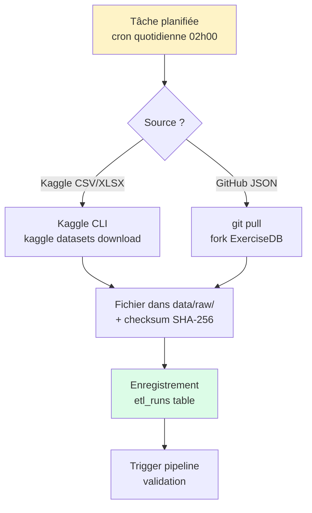
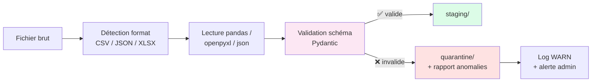
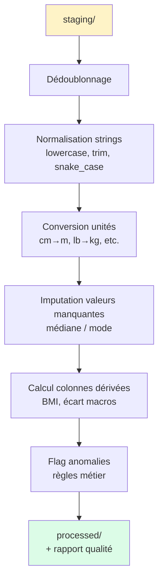
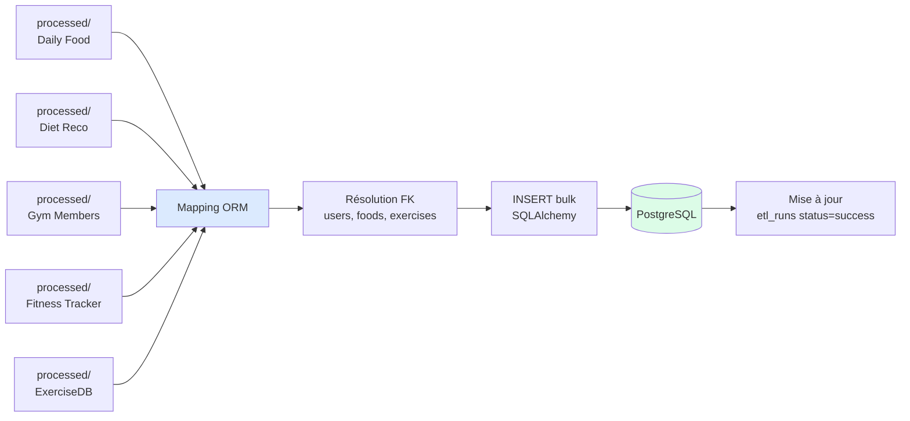
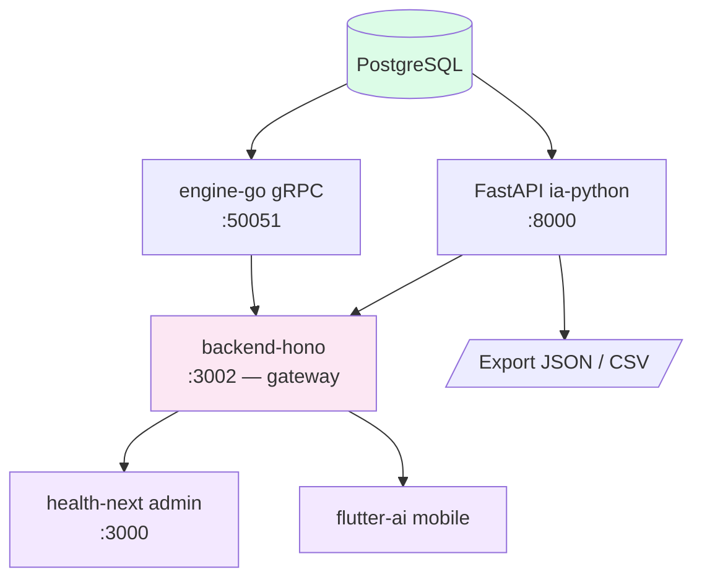
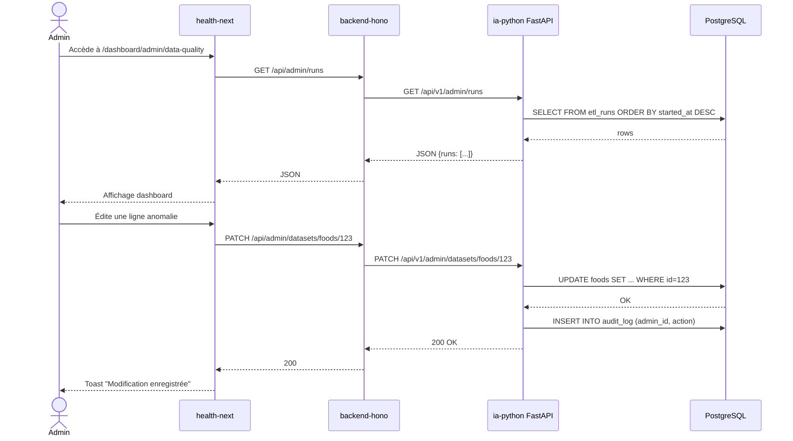
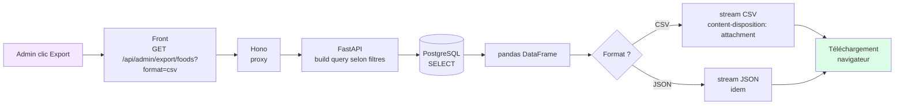

# Diagramme des flux de données — MSPR501

> Livrable L1 — Cahier des charges section IV.1 : *« Ce rapport sera accompagné d'un diagramme des flux de données, permettant de visualiser le cheminement complet entre la collecte brute, les traitements de nettoyage, le stockage en base relationnelle et l'exposition via API. »*

---

## 1. Vue d'ensemble (haut niveau)



---

## 2. Flux détaillé étape par étape

### 2.1 Étape 1 — Collecte brute



**Outils** : Kaggle CLI, GitHub Actions (sync ExerciseDB), cron Linux.
**Sortie** : fichiers bruts versionnés dans `ia-python/data/raw/` + entrée dans la table `etl_runs`.

---

### 2.2 Étape 2 — Validation



**Règles appliquées** : types, ranges, présence champs obligatoires, unicité.
**Sortie** : `data/staging/<source>.parquet` (valides) + `data/quarantine/<source>_invalid_<run_id>.csv` (rejetés).

---

### 2.3 Étape 3 — Nettoyage et normalisation



**Outils** : pandas, numpy, scikit-learn (KNN imputation pour cas complexes).
**Sortie** : `data/processed/<source>.parquet` + métriques de qualité dans `etl_runs`.

---

### 2.4 Étape 4 — Consolidation et chargement BDD



**Tables peuplées** : `users`, `profiles`, `foods`, `exercises`, `meal_logs`, `workout_sessions`, `daily_logs`, `recommendations`.
**Sortie** : base prête pour consommation API + run marqué `success` dans `etl_runs`.

---

### 2.5 Étape 5 — Exposition via API



**Endpoints clés** :
- `GET /api/v1/foods` — catalogue alimentaire
- `GET /api/v1/exercises` — catalogue exercices
- `GET /api/v1/users/:id/meal-logs` — historique nutrition
- `GET /api/v1/users/:id/workouts` — historique sport
- `GET /api/admin/runs` — supervision pipeline
- `GET /api/admin/export/:source` — export consolidé

---

## 3. Flux administrateur (interface health-next)



---

## 4. Flux d'export



---

## 5. Légende et conventions

| Couleur | Signification |
|---|---|
| 🟡 Jaune | Sources externes (collecte) |
| 🔵 Bleu | Pipeline ETL (transformation) |
| 🟢 Vert | Stockage / Sortie réussie |
| 🌸 Rose | Couche API / Gateway |
| 🟣 Violet | Consommateurs (UI) |
| 🔴 Rouge | Erreur / Quarantaine |

---

## 6. Génération des assets

Les diagrammes ci-dessus sont en **Mermaid** (texte versionné dans git). Pour produire des assets PNG/SVG destinés à la soutenance et au rapport technique :

```bash
# Installation
npm install -g @mermaid-js/mermaid-cli

# Export PNG haute résolution
mmdc -i 05-Diagramme-Flux-Donnees.md -o assets/flow-overview.png -w 2400 -H 1600 -b transparent

# Export SVG pour usage web (page admin /dashboard/admin/flow)
mmdc -i 05-Diagramme-Flux-Donnees.md -o assets/flow-overview.svg -b transparent
```

Les assets générés sont placés dans `docs/mspr501/assets/`. Ils sont aussi consommés par la page `app/dashboard/admin/flow/page.tsx` (#25) pour la visualisation interactive.
