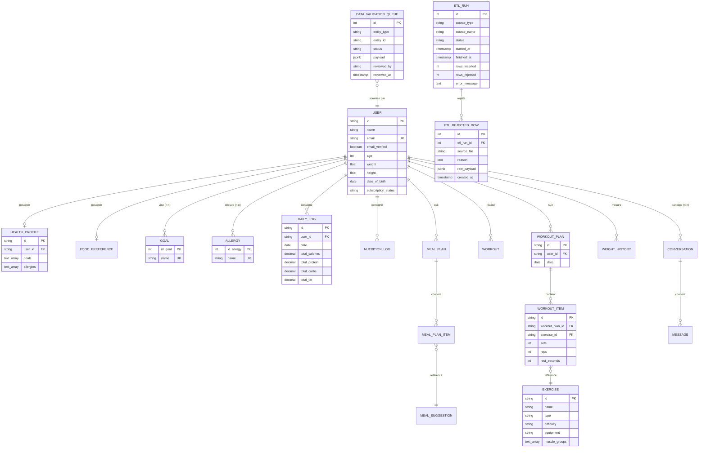
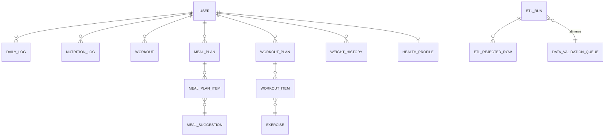

# Modèle de données — Merise (MCD / MLD / MPD)

> Livrable L4 — Cahier des charges section IV.4 : *« Un modèle de données relationnel documenté au format Merise (MCD/MLD/MPD) ou UML, devra être livré. »*

---

## 1. Périmètre

Le modèle couvre 4 grands domaines fonctionnels :

1. **Identité & authentification** — comptes utilisateurs, sessions
2. **Profil & objectifs** — données démographiques, allergies, objectifs santé
3. **Nutrition** — aliments, repas loggés, plans de repas
4. **Activité physique** — exercices, séances, plans d'entraînement
5. **Gouvernance des données** (ETL) — runs d'ingestion, lignes rejetées, file de validation
6. **IA & feedback** — prédictions, conversations, feedback utilisateur

---

## 2. MCD — Modèle Conceptuel de Données

Le MCD décrit les entités métier et leurs relations, **sans aucune contrainte technique**.



### 2.1 Cardinalités (notation Merise)

| Relation | Cardinalité côté A | Cardinalité côté B | Sens métier |
|---|---|---|---|
| USER ↔ HEALTH_PROFILE | (0,1) | (1,1) | Un user a 0 ou 1 profil santé ; un profil appartient à 1 user |
| USER ↔ GOAL (via Asso_Goal_User) | (0,n) | (0,n) | Un user peut viser plusieurs objectifs |
| USER ↔ ALLERGY (via Asso_Allergie_User) | (0,n) | (0,n) | Un user peut déclarer plusieurs allergies |
| USER ↔ DAILY_LOG | (1,1) | (0,n) | Un user a 0..N logs quotidiens |
| USER ↔ WEIGHT_HISTORY | (1,1) | (0,n) | Historique de poids |
| MEAL_PLAN ↔ MEAL_PLAN_ITEM | (1,1) | (1,n) | Un plan contient au moins 1 item |
| WORKOUT_PLAN ↔ WORKOUT_ITEM | (1,1) | (1,n) | Idem côté workout |
| ETL_RUN ↔ ETL_REJECTED_ROW | (1,1) | (0,n) | Un run peut rejeter 0..N lignes |

---

## 3. MLD — Modèle Logique de Données

Le MLD transforme le MCD en tables relationnelles, en explicitant les clés étrangères.

### 3.1 Tables principales (extrait)

```
USER (id, name, email, email_verified, image, age, weight, height,
      date_of_birth, subscription_status, created_at, updated_at)

ACCOUNT (id, account_id, provider_id, #user_id, access_token, refresh_token,
         id_token, ..., created_at, updated_at)

SESSION (id, expires_at, token, #user_id, ip_address, user_agent, ...)

HEALTH_PROFILE (id, #user_id, goals[], allergies[], createdAt, updatedAt)

FOOD_PREFERENCE (id, #user_id, allergies[], disliked_ingredients[],
                 diet_type, created_at, updated_at)

GOAL (id_goal, name)
ALLERGY (id_allergy, name)
ASSO_GOAL_USER (id, #user_id, #goal_id)
ASSO_ALLERGIE_USER (id, #user_id, #allergy_id)

DAILY_LOG (id, #user_id, date, total_calories, total_protein,
           total_carbs, total_fat, created_at, updated_at)

NUTRITION_LOG (id, #user_id, logged_at, calories, protein, carbs, fat)

MEAL_SUGGESTION (id, name, calories, protein, carbs, fat, ...)
MEAL_PLAN (id, #user_id, date, ...)
MEAL_PLAN_ITEM (id, #meal_plan_id, #meal_suggestion_id, meal_type, ...)

EXERCISE (id, name, type, difficulty, equipment, muscle_groups[])
WORKOUT (id, #user_id, date, duration_min, calories_burned, ...)
WORKOUT_PLAN (id, #user_id, date)
WORKOUT_ITEM (id, #workout_plan_id, #exercise_id, sets, reps, rest_seconds)

WEIGHT_HISTORY (id, #user_id, measured_at, weight)

CONVERSATION (id, title, created_at)
ASSO_USER_CONV (id, #user_id, #conversation_id)
MESSAGE (id, #conversation_id, role, content, created_at)

API_PREDICTIONS (id, #user_id, model, input, output, confidence, created_at)
API_FEEDBACK (id, #prediction_id, rating, comment, created_at)

ETL_RUNS (id, source_type, source_name, status, started_at, finished_at,
          rows_inserted, rows_rejected, error_message)

ETL_REJECTED_ROWS (id, #etl_run_id, source_file, reason, raw_payload, created_at)

DATA_VALIDATION_QUEUE (id, entity_type, entity_id, status, payload,
                       reviewed_by, reviewed_at, created_at)
```

**Convention** : `#` préfixe les clés étrangères, `[]` indique un tableau, les noms entre parenthèses listent l'ordre des colonnes.

### 3.2 Normalisation

Le MLD respecte la **3ème forme normale (3NF)** :

- **1NF** ✅ : chaque attribut est atomique (sauf colonnes `TEXT[]` PostgreSQL — choix volontaire pour goals/allergies, justifié par la faible cardinalité et la simplicité de requêtage)
- **2NF** ✅ : toute colonne non-clé dépend de la clé entière (pas de clés composites partielles)
- **3NF** ✅ : aucune dépendance transitive (pas de redondance entre tables)

**Dénormalisations volontaires** :
- `daily_log.total_calories/protein/carbs/fat` : agrégat précalculé des `nutrition_log` du jour. Justification : performance des dashboards admin (#21, #24) — l'agrégat à la volée serait trop lent sur de grosses volumétries.
- `health_profile.goals[]` et `health_profile.allergies[]` : duplique l'info des tables d'association. Justification : éviter un JOIN sur les pages utilisateur fréquentes ; sync via trigger ou logique applicative.

---

## 4. MPD — Modèle Physique de Données

Le MPD est l'implémentation concrète en PostgreSQL 16, déjà présente dans `ia-python/sql/init/01_schema.sql` (365 lignes).

### 4.1 Types PostgreSQL utilisés

| Type Merise | Type PostgreSQL | Usage |
|---|---|---|
| Identifiant texte | `TEXT PRIMARY KEY` | IDs externes (Better Auth) |
| Identifiant numérique | `SERIAL PRIMARY KEY` | Tables internes (ETL, etc.) |
| Date+heure | `TIMESTAMPTZ` | Toujours avec timezone |
| Date simple | `DATE` | Journaux quotidiens |
| Décimal monétaire/quantité | `NUMERIC` | Calories, macros (pas de float pour éviter dérives) |
| Mesure physique | `DOUBLE PRECISION` | Poids, taille (tolérance sur précision) |
| Booléen | `BOOLEAN` | Flags |
| Énumération | `VARCHAR(N) CHECK (... IN (...))` | status, role, diet_type |
| JSON | `JSONB` | Payloads ETL (raw_payload), conversations |
| Tableau | `TEXT[]` | goals, allergies, muscle_groups |

### 4.2 Contraintes d'intégrité

```sql
-- Référentielle avec cascade pour les données dépendantes d'un user
FOREIGN KEY (user_id) REFERENCES "user"(id) ON DELETE CASCADE

-- Contraintes de domaine
CHECK (calories >= 0)
CHECK (protein >= 0)
CHECK (status IN ('PENDING', 'VALIDATED', 'REJECTED'))

-- Unicité métier
UNIQUE (user_id, date)              -- 1 daily_log par user et par jour
UNIQUE (user_id, logged_at)         -- idem nutrition_log
UNIQUE (email)                      -- 1 user par email
```

### 4.3 Index

Les index existants dans `01_schema.sql` couvrent :
- Tous les FK fréquemment joints (`user_id` sur daily_log, nutrition_log, workout, meal_plan, etc.)
- Les colonnes de filtre temporel (`date`, `started_at`)
- Le statut des runs ETL et de la queue de validation

Index complémentaires recommandés (à ajouter pour les pages admin) :

```sql
CREATE INDEX IF NOT EXISTS idx_etl_rejected_etl_run_id ON etl_rejected_rows(etl_run_id);
CREATE INDEX IF NOT EXISTS idx_validation_queue_entity ON data_validation_queue(entity_type, status);
CREATE INDEX IF NOT EXISTS idx_user_subscription ON "user"("subscriptionStatus");
```

### 4.4 Vues

Une vue agrégée existe déjà pour le dashboard admin :

```sql
CREATE OR REPLACE VIEW vw_user_progress AS
SELECT u.id AS user_id, u.email, u.age, u."subscriptionStatus",
       wh.measured_at, wh.weight, nl.calories, ...
FROM "user" u
LEFT JOIN weight_history wh ON ...
LEFT JOIN nutrition_log nl ON ...;
```

Vues à ajouter pour les besoins MSPR501 :

```sql
CREATE OR REPLACE VIEW vw_etl_quality_24h AS
SELECT source_name,
       COUNT(*) AS run_count,
       SUM(rows_inserted) AS total_inserted,
       SUM(rows_rejected) AS total_rejected,
       ROUND(100.0 * SUM(rows_rejected) / NULLIF(SUM(rows_inserted + rows_rejected), 0), 2) AS rejection_rate_pct
FROM etl_runs
WHERE started_at > NOW() - INTERVAL '24 hours'
GROUP BY source_name;

CREATE OR REPLACE VIEW vw_user_demographics AS
SELECT
    CASE
        WHEN age BETWEEN 18 AND 24 THEN '18-24'
        WHEN age BETWEEN 25 AND 34 THEN '25-34'
        WHEN age BETWEEN 35 AND 44 THEN '35-44'
        WHEN age BETWEEN 45 AND 54 THEN '45-54'
        ELSE '55+'
    END AS age_bucket,
    "subscriptionStatus",
    COUNT(*) AS user_count
FROM "user"
GROUP BY age_bucket, "subscriptionStatus";
```

Ces vues simplifient les requêtes du dashboard admin (#21, #24) en évitant des sous-requêtes côté API.

---

## 5. Diagramme synthétique (entités principales)



---

## 6. Conventions de nommage

| Élément | Convention | Exemple |
|---|---|---|
| Table | snake_case singulier | `user`, `daily_log`, `etl_run` |
| Colonne | snake_case | `created_at`, `user_id` |
| Clé primaire | `id` (texte ou serial) | `id` |
| Clé étrangère | `<entité>_id` | `user_id`, `meal_plan_id` |
| Index | `idx_<table>_<colonne(s)>` | `idx_daily_log_user_id` |
| Vue | `vw_<sujet>` | `vw_user_progress` |
| Contrainte CHECK | `<table>_<colonne>_check` | (auto-généré par PG) |

**Note** : certaines tables existantes utilisent `camelCase` (`subscriptionStatus`, `dateOfBirth`) — héritage de Better Auth. Une migration future pourra harmoniser, mais ce n'est pas bloquant pour MSPR501.

---

## 7. Évolutions prévues (perspectives)

Le modèle est conçu pour accueillir les modules IA mentionnés en section II du cahier des charges :

- **Table `recommendations`** (à créer) : stocker les recos personnalisées générées par l'IA, avec lien vers `users` et horodatage.
- **Table `biometrics_realtime`** (à créer) : données issues des objets connectés (Premium+) — séries temporelles avec partitionnement par jour.
- **Index BRIN** sur les futures tables de séries temporelles pour optimiser les requêtes par plage de dates.

---

## 8. Export des diagrammes

Les diagrammes Mermaid de ce document peuvent être exportés en PNG/SVG pour la soutenance :

```bash
mmdc -i 12-Modele-Donnees-Merise.md -o assets/mcd.png -w 2400 -H 1600 -b transparent
```

Les assets sont placés dans `docs/mspr501/assets/`.
